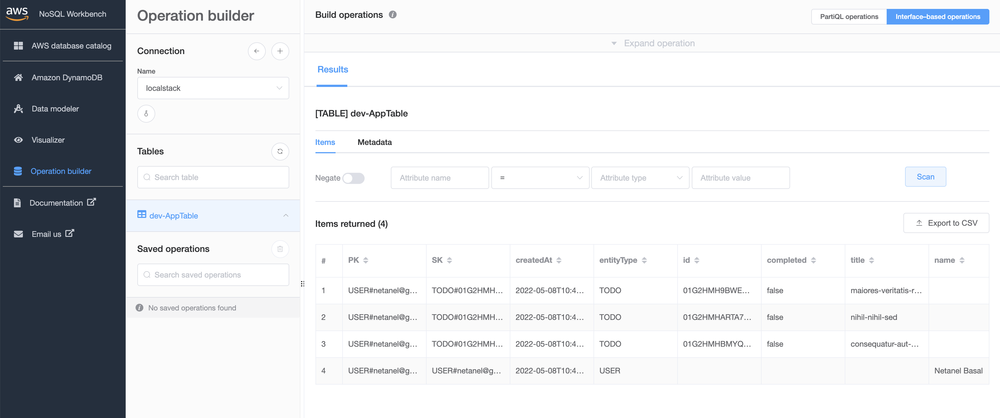

<br />
<p align="center">
 
</p>

<h1 align="center">Nx Serverless</h1>

> The Ultimate Monorepo Starter for Node.js Serverless Applications

✅ &nbsp;First-Class Typescript Support<br>
✅ &nbsp;DynamoDB Single Table Design<br>
✅ &nbsp;Shared API Gateway<br>
✅ &nbsp;Environments Configuration<br>
✅ &nbsp;CORS<br>
✅ &nbsp;JWT Auth Middleware<br>
✅ &nbsp;Http Params Validation<br>
✅ &nbsp;Typed Proxy Handlers<br>
✅ &nbsp;Auto Generators<br>
✅ &nbsp;Localstack<br>
✅ &nbsp;ESLint<br>
✅ &nbsp;Jest<br>
✅ &nbsp;Github Actions

<hr />

[](http://www.serverless.com)
[](https://nx.dev/)


[](https://github.com/sudokar/nx-serverless/blob/master/LICENSE)
[](https://github.com/sudokar/nx-serverless)


## Prerequisites

- Docker
- Node.js

## Getting Started

- Run git clone https://github.com/ngneat/nx-serverless.git your-app-name
- Run `npm install`
- Run `npm run localstack` ( Check that it works by going to http://localhost:4566/health)
- Run `npx nx deploy core --stage local` to create the table
- Update the `environment` files based on your configuration
- Run `npm run serve`

## About the App

The application contains three services:

#### Auth Service:

The auth service is responsible for authentication. It exposes one route for signing up:

```bash
curl --request POST 'http://localhost:3001/dev/auth/sign-up' \
--data-raw '{
    "email": "netanel@gmail.com",
    "name": "Netanel Basal"
}'
```

The request returns a JWT, which is used for accessing protected routes.

#### Users Service:

The users service is responsible for managing users. It exposes one route:

```bash
curl 'http://localhost:3003/dev/user' --header 'Authorization: token TOKEN'
```

The request returns the logged-in user.

#### Todos Service:

The todos service is responsible for managing todos. A user has many todos. It exposes CRUD routes:

```bash
// Get user todos
curl 'http://localhost:3005/dev/todos' --header 'Authorization: token TOKEN'

// Get a single todo
curl 'http://localhost:3005/dev/todos/:id' --header 'Authorization: token TOKEN'

// Create a todo
curl --request POST 'http://localhost:3005/dev/todos' \
--header 'Authorization: token TOKEN'
--data-raw '{
    "title": "Learn Serverless"
}'

// Update a todo
curl  --request PUT 'http://localhost:3005/dev/todos/:id' \
--header 'Authorization: token TOKEN' \
--data-raw '{
    "completed": true
}'
```

## DynamoDB GUI
[Download](https://docs.aws.amazon.com/amazondynamodb/latest/developerguide/workbench.settingup.html) NoSQL Workbench for DynamoDB and connect to `http://localhost:4566`.

<p align="center">
 
</p>

## Commands

```bash
nx serve <service-name>
nx deploy <service-name>
nx remove <service-name>
nx build <service-name>
nx lint <service-name>
nx test <service-name>

// Use different enviroment
NODE_ENV=prod nx deploy <service-name> 
NODE_ENV=stg nx deploy <service-name> 

// Run only affected
nx affected:test
nx affected:deploy
```

## Generators

```bash
// Generate a service
yarn g:service tags

// Generate handler
yarn g:handler handler-name

// Generate http handler
yarn g:http-handler create-tag

// Generate a model
yarn g:model tag
```


<hr />

## CI/CD Pipeline with Github Actions

The pipeline has been configured to run everytime a push/pull_request is made to the `main` branch. You should uncomment the `ci.yml` workflow.

#### Workflow Steps

- Checkout: The `checkout` action is used to checkout the source code.

- Node setup: The `setup-node` action is used to optionally download and cache distribution of the requested Node.js version.

- lint and test: The `lint` and `test` runs only on affected projects.

- Configure AWS credentials: The credentials needed are `AWS_ACCESS_KEY_ID` and `AWS_SECRET_ACCESS_KEY` and should be set as Github __secrets__.

- Each branch should be prefixed with the `environment` name. For example, if we have a `stg-feature-name` branch and open a pull request to the `main` branch, it will set `NODE_ENV` to `stg` and deploy to this environment. 

By merging the pull request to the `main` branch, `NODE_ENV` is set to `prod`, and the deployment is done to production.

The workflow file can have as many environments as you need.

## Further help

- Visit [Serverless Documentation](https://www.serverless.com/framework/docs/) to learn more about Serverless framework
- Visit [Nx Documentation](https://nx.dev) to learn more about Nx dev toolkit
- Visit [LocalStack](https://localstack.cloud/) to learn more about it
## Contribution

Found an issue? feel free to raise an issue with information to reproduce.

Pull requests are welcome to improve.

## License

MIT

This project is a fork of [nx-serverless](https://github.com/sudokar/nx-serverless)

<a href="https://www.flaticon.com/free-icons/monster" title="monster icons">Monster icons created by Smashicons - Flaticon</a>
